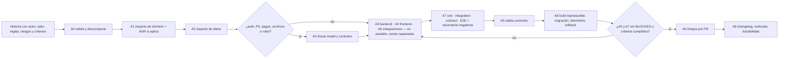

# Plan de ejecución — Portal Único del Afiliado (Fedesoft)

**Versión 0.2 · 15 de septiembre de 2026 · Estado: propuesto para aprobación** — v0.2 incorpora la consola de administración y la analítica (`docs/01-consola-administracion.md`, ADR-005) como épicas transversales EPIC-13 y EPIC-14.

Este es el índice de trabajo del proyecto. Responde a cinco preguntas: **qué** se construye, **cómo**, **cuándo**, **con qué agentes** y **bajo qué modelo**. Se actualiza al cierre de cada iteración. Los detalles técnicos viven en los documentos rectores (`docs/base/`) y las decisiones en `docs/adr/`; aquí no se repiten, se enlazan.

---

## 0. Resumen ejecutivo

- **Primera etapa (semanas 1–9):** fundación técnica → núcleo e identidad → recorrido vertical crítico *gerente autenticado → estado de cuenta → pago → webhook → factura DIAN → afiliación al día → certificado/sello*. Es la "primera meta de sistema" del documento base y el trámite que más desgaste genera hoy.
- **Por qué ese orden:** obliga a resolver temprano identidad, datos, seguridad, integración fiscal, asincronía, auditoría y operación. Todo lo demás (formación, comunidades, directorio, verticales, Cenisoft, KAM) se apoya después sobre una base probada.
- **Ritmo:** iteraciones semanales, una épica o historia por iteración, con demo y decisiones al cierre. Hitos: fundación (S2), núcleo (S5), recorrido crítico (S9), Eje 1 completo (S13), Eje 2 completo (S16), piloto (S20).
- **Lo que se necesita de Fedesoft en las primeras 4 semanas:** cuatro decisiones (proveedor de identidad, pasarela, facturador y reglas de "al día") y el material de marca. Cada una tiene una propuesta por defecto en la sección 6 para no bloquear el avance.

---

## 1. Qué — alcance por fase

Las fases son las del documento base (sección 12); aquí se concretan entregables y criterio de salida (gate). El repositorio está vacío, así que **todo empieza por la Fase 0**.

**Iteración de diseño (previa a la Fase 0) — prototipo visual.** Antes de montar la fundación técnica se construye un **prototipo navegable sin backend** para la presentación a Presidencia Ejecutiva: enamorar visualmente y dejar ver el alcance. Diez pantallas con datos simulados y un selector de escenarios (MIPYME al día / con pago vencido / líder de talento / empresa grande con KAM). El brief completo está en `docs/04-prompt-prototipo-visual.md`. No es trabajo desechable: sus tokens y componentes se convierten en `packages/ui` y sus pantallas en el *shell* de experiencia de la Fase 0.

| Fase | Resultado | Entregables concretos | Gate de salida |
|---|---|---|---|
| **0 · Fundación** (EPIC-00) | Base reproducible y decisiones cerradas | Monorepo pnpm + Turborepo (`apps/web`, `apps/api`, `apps/worker`, `packages/ui`, `packages/contracts`, `packages/config`, `packages/testing`) · Docker Compose local (PostgreSQL, Redis, MinIO, OIDC de desarrollo, Mailpit) · CI con lint, typecheck, test, build, migraciones en BD efímera, escaneo de secretos y dependencias · esquema de variables de entorno validado · esquema Prisma inicial del núcleo (Organization, Contact, User, OrganizationUser, Role, Membership, MembershipHistory, AuditEvent, Outbox) · threat model v0 · **UX shell** con design system y tokens de marca (layout, navegación por rol/segmento, páginas de login, 403, 404, error y vacío) · observabilidad base (logs estructurados, `correlation_id`, OpenTelemetry, Sentry, health checks) · ADR-001 a ADR-004 aceptados | `pnpm install && pnpm lint && pnpm typecheck && pnpm test && pnpm build` en limpio; `docker compose up` levanta todo; CI verde en PR; portal navegable con datos sintéticos |
| **1 · Núcleo e identidad** (EPIC-01, EPIC-02) | Empresa, contactos y roles operativos | CRUD de Organization/Contact/Membership con historial y auditoría append-only · admin básico para Operaciones · login OIDC con contexto de organización · RBAC + ABAC (`organization_id`, segmento, estado de afiliación) · MFA para perfiles internos · pruebas automáticas de fuga entre tenants | Un gerente inicia sesión y ve solo su empresa; un líder de talento ve una vista distinta; Operaciones administra el padrón; suite de aislamiento por tenant en verde; A5 sin bloqueantes |
| **2 · Dinero y documentos** (EPIC-03, 04, 05) | Recorrido crítico E2E | Cargos y estado de cuenta · `PaymentAttempt` con idempotencia · adaptador de pasarela (sandbox) + webhook firmado, con replay e idempotencia · conciliación · `FiscalProvider` (mock contractual → sandbox) con CUFE, reintentos y dead-letter · regla "al día" parametrizada · certificado con folio y snapshot + sello, descarga firmada | Historia 13.1 completa: webhook duplicado no duplica pago; fallo del facturador no pierde el pago; cada transición con `AuditEvent` y `correlation_id`; demo E2E grabada |
| **3 · Autoservicio ampliado** (EPIC-06, 07, 08) | Eje 1 completo | Formación (catálogo, cupos, inscripción de un clic, historial por empresa, grabaciones) · Comunidades (acceso por rol, cupos, materiales) · Directorio verificado alimentado por el perfil + ofertas #AfiliadosFedesoft + insights por tipo de afiliación · API pública de solo lectura del directorio | Historia 13.2; lista de verificación (arquitectura, sección 6) en "cumple" para módulos 1–6 |
| **4 · Alto contacto** (EPIC-09, 10, 11) | Eje 2 completo | Verticales (agenda, documentos, participación) · Proyectos/oportunidades Cenisoft filtrados por perfil con postulación y seguimiento · Panel KAM consolidado sin tablas paralelas | Historia 13.3; el KAM solo ve sus empresas; el panel consolida desde los dominios originales |
| **5 · Hardening y salida** (EPIC-12) | Producción controlada | Pentest y remediación · SLO medidos · backups y restore drill · migración del padrón ensayada en staging · manuales por rol · redirecciones desde los sitios actuales · piloto con un grupo de empresas | Sin hallazgos críticos/altos abiertos; restore documentado; piloto con métricas de autoservicio (trámites sin intervención humana) |

**Transversal a todas las fases — consola de administración y analítica** (definido antes de la Fase 1 en `docs/01-consola-administracion.md`):

| Fase | EPIC-13 · Consola y parametrización | EPIC-14 · Analítica y resultados |
|---|---|---|
| 0 | `apps/admin` con guard interno y MFA; auditoría base; dominio Config (catálogos y parámetros base) | Esquema `analytics`; diccionario de métricas v0 |
| 1 | Ficha 360; CRUD de empresas, contactos y afiliaciones; bandeja de solicitudes; usuarios internos y roles; mapeo de importación del padrón | Dashboard de Operaciones v1 |
| 2 | Tarifas y cargos masivos; conciliación; facturas y colas; certificados (excepciones, revocación); monitor de webhooks | Dashboard de Cartera v1 |
| 3 | Administración de formación, comunidades, directorio y campañas | Dashboards de formación, comunidades y visibilidad |
| 4 | Administración de verticales, oportunidades y cuentas estratégicas | Dashboard de relacionamiento |
| 5 | Soporte controlado endurecido; pentest de consola; flags de piloto | Conexión del BI existente (Power BI / Looker); tablero de metas; reporte mensual; exportaciones programadas |

**Fuera del alcance inicial** (backlog fase 6): programas de talento (Talentsoft, Creadores TI, conexión con universidades), CMS del sitio institucional, app móvil nativa.

---

## 2. Cómo — método de construcción

### 2.1 Arquitectura
Monolito modular con límites de dominio y eventos internos por outbox (ADR-001), stack TypeScript de extremo a extremo (ADR-002), proveedores detrás de adaptadores, `organization_id` como frontera de seguridad, autorización siempre en servidor. Estructura objetivo del repositorio: sección 9 de `docs/base/02-documento-base-desarrollo.md`.

### 2.2 Flujo por historia
Cada historia sigue el protocolo de 10 pasos de `CLAUDE.md`. En términos de agentes:

### 2.3 Control de versiones e integración
- `main` protegida; trabajo en ramas `feat/EPIC-xx-descripcion`; integración solo por PR con checks verdes y revisión del gestor TI.
- Plantilla de PR: qué cambia, ADR relacionado, migraciones, pruebas ejecutadas (con salida), riesgos, plan de rollback.
- Conventional Commits en inglés; squash merge; un PR por historia (pequeño y revisable).

### 2.4 Calidad y seguridad
- Pirámide de pruebas y gates: secciones 14 y 16 del documento base (unit obligatorias en dominio; integration con testcontainers; contract con fixtures de webhooks; E2E Playwright por rol; seguridad bloqueante antes de release).
- Threat model por flujo antes de implementar identidad, pagos, archivos o privilegios; SAST/SCA/secret scanning en cada PR; pentest antes de producción.
- Definition of Done: sección 16 del documento base. "Terminado" solo con lint, typecheck, test, build y migraciones ejecutados en limpio.

### 2.5 Entornos y despliegue
`local` (Docker Compose) → `test/CI` (efímero) → `staging` (despliegue automático desde `main`) → `production` (despliegue manual con checks verdes). Secretos por entorno, migraciones forward-only, feature flags por módulo, rollback de aplicación independiente del de datos.

---

## 3. Cuándo — cronograma por iteraciones

**Supuestos:** iteraciones de una semana; un tech lead (sesión A0) con subagentes; el gestor TI de Cenisoft revisa PRs a diario; Fedesoft responde decisiones en ≤ 1 semana; credenciales de sandbox de pasarela y facturador disponibles antes de las semanas 7 y 8. Si un supuesto falla, el hito se corre y se re-planifica en la revisión semanal, no en silencio.

| Semana | Fase | Iteración · Épica | Entregable demostrable | Depende de |
|---|---|---|---|---|
| S1 | 0 | It.0 · EPIC-00a: monorepo, CI, Docker, env schema, Prisma del núcleo, ADRs | `pnpm build` y CI en verde; `docker compose up` | Aprobación de este plan |
| S2 | 0 | It.1 · EPIC-00b: UX shell + design system con tokens de marca, API skeleton, observabilidad, seeds | Portal navegable con datos sintéticos (sin login real) | Material de marca (logo, tipografías) |
| S3 | 1 | It.2 · EPIC-01a: Organization, Contact, Membership, admin básico | Operaciones crea y edita empresas y contactos | Criterio de segmentación (propuesta por defecto) |
| S4 | 1 | It.3 · EPIC-01b + EPIC-02a: historial, auditoría; login OIDC + contexto de organización | Un gerente inicia sesión y ve su ficha | Decisión OIDC (o Keycloak dev) |
| S5 | 1 | It.4 · EPIC-02b: RBAC/ABAC, roles, MFA interno, pruebas de aislamiento | Vistas distintas por rol y segmento; suite de seguridad verde | — |
| S6 | 2 | It.5 · EPIC-03a: cargos, estado de cuenta, `PaymentAttempt` | Gerente ve estado de cuenta y vencimientos | Reglas de cartera y "al día" |
| S7 | 2 | It.6 · EPIC-03b: adaptador de pasarela sandbox, webhook firmado, conciliación | Pago aprobado actualiza estado server-to-server; replay no duplica | Decisión de pasarela + sandbox |
| S8 | 2 | It.7 · EPIC-04: `FiscalProvider` (mock contractual → sandbox), CUFE, reintentos, dead-letter | Factura emitida y persistida; el fallo del facturador no pierde el pago | Decisión de facturador + sandbox |
| S9 | 2 | It.8 · EPIC-05: certificado con folio, sello, descarga firmada; demo E2E | **Primera meta de sistema demostrada** | Formato legal del certificado |
| S10–S11 | 3 | It.9–10 · EPIC-06 Formación | Catálogo, inscripción de un clic, historial por empresa | Catálogo inicial de cursos/sesiones |
| S12 | 3 | It.11 · EPIC-07 Comunidades | Inscripción filtrada por rol, cupos, materiales | Lista de comunidades y reglas de acceso |
| S13 | 3 | It.12 · EPIC-08 Directorio e insights + API pública | Directorio verificado desde el perfil; ofertas; insights por tipo | Fuentes de insights |
| S14 | 4 | It.13 · EPIC-09 Verticales | Agenda, documentos y participación por vertical | Lista de verticales activas |
| S15 | 4 | It.14 · EPIC-10 Cenisoft | Tablero de oportunidades filtrado por perfil; postulación | Proceso actual de convocatorias |
| S16 | 4 | It.15 · EPIC-11 KAM | Panel consolidado para cuentas estratégicas | Criterio de cuenta estratégica y asignación de KAM |
| S17–S20 | 5 | It.16–19 · EPIC-12 Hardening y salida | Pentest, SLO, DR, migración del padrón, manuales, redirecciones, piloto | Padrón y cartera para migrar; cloud definido |

**Hitos:** H1 Fundación (S2) · H2 Núcleo e identidad (S5) · H3 Recorrido crítico (S9) · H4 Eje 1 (S13) · H5 Eje 2 (S16) · H6 Piloto (S20).
La estimación se re-calibra en cada hito con la velocidad real de las iteraciones previas.

**Absorción de la consola y la analítica (EPIC-13/14) — decidido: Opción A.** Cada iteración incluye su rebanada de consola con dos hilos de frontend en paralelo (portal y consola), instancias separadas del agente A4 sobre el mismo backend; los hitos no se mueven y se re-calibra en H2. Respaldo, Opción B: +1 semana en Fase 1, +1 en Fase 2 y +1 en Fase 5 (23 semanas; recorrido crítico en S10) si el hilo de consola atrasa el portal.

---

## 4. Con qué agentes — modelo operativo

Los agentes representan responsabilidades técnicas estables (documento base, sección 10), no pantallas. Están definidos en `.claude/agents/` y se invocan desde la sesión principal (A0) con la herramienta de subagentes, pasando el nombre del archivo como tipo de agente. Cada uno recibe una tarea acotada y devuelve un informe con formato fijo; A0 integra las conclusiones sin volcar archivos al contexto principal.

| Agente | Archivo | Cuándo se invoca | Entrada | Salida | Veto |
|---|---|---|---|---|---|
| A0 · Orquestador / Tech lead | sesión principal | Siempre | Épica o historia | Backlog, asignación, integración, PR | — |
| A1 · Arquitectura y dominio | `a1-arquitectura-dominio` | Antes de implementar; revisión estructural de PR | Historia + documentos rectores | Contratos, eventos, ADR, veredicto | Estructural |
| A2 · Datos y migraciones | `a2-datos-migraciones` | Cualquier cambio de esquema | Contratos de A1 | Prisma, migraciones, seeds, pruebas de integridad | — |
| A3 · Backend/API | `a3-backend-api` | Implementación de casos de uso | Contratos A1/A2, criterios de aceptación | Módulos NestJS, OpenAPI, pruebas | — |
| A4 · Frontend/UX | `a4-frontend-ux` | Implementación de pantallas | Contratos, tokens de marca, "qué ve el afiliado" | Rutas, componentes, estados, pruebas UI | — |
| A5 · Seguridad | `a5-seguridad` | Antes (threat model) y después (validación) de flujos con auth, PII, pagos, archivos, roles | Diseño o PR | Amenazas, controles, hallazgos, veredicto | **Sí** |
| A6 · Integraciones fiscal/pagos | `a6-integraciones-fiscal-pagos` | Cuando hay proveedor externo | Ports del dominio | Adaptadores, mocks contractuales, webhooks, conciliación | — |
| A7 · QA y pruebas | `a7-qa-pruebas` | Al terminar la implementación de una historia | Criterios de aceptación + PR | Plan de pruebas, ejecución real, defectos, veredicto | **Sí** |
| A8 · DevOps/Observabilidad | `a8-devops-observabilidad` | Cambios operativos, infraestructura, pipelines | PR o requerimiento operativo | Pipelines, Docker, telemetría, rollback, costos | — |
| A9 · Documentación/Release | `a9-documentacion-release` | Cierre de iteración o épica | PRs integrados y evidencia | Changelog, runbooks, manuales, trazabilidad | — |

**Reglas de coordinación**
- A3, A4 y A6 trabajan en paralelo en ramas o worktrees separados, solo en los archivos de su dominio; una dependencia cruzada se convierte en tarea para el dueño, nunca en "arreglo rápido".
- A5 y A7 revisan siempre antes de integrar; un `BLOCKED` devuelve la historia a implementación.
- El frontend corre en dos hilos (portal `apps/web` y consola `apps/admin`) con instancias separadas de A4, cada una con su historia y su rama (Opción A).
- A0 no implementa cambios grandes sin revisión de A1; sí puede hacer cambios pequeños y de integración.
- Tras las tres primeras iteraciones se revisa el reparto: fusionar agentes poco usados o dividir los saturados (ADR-003).

---

## 5. Bajo qué modelo

### 5.1 Modelos de IA por agente
El criterio es capacidad de juicio donde el error es caro (arquitectura, seguridad, integración) y velocidad/costo donde el trabajo está bien especificado.

| Agente | Alias de modelo en el agente | Razón |
|---|---|---|
| A0 Orquestador | Sesión principal: el modelo de mayor capacidad disponible (familia Claude 5) | Descomposición, juicio, integración, conversación con el equipo |
| A1 Arquitectura · A5 Seguridad | `opus` | Decisiones estructurales y análisis de amenazas |
| A2 Datos · A3 Backend · A4 Frontend · A6 Integraciones · A7 QA · A8 DevOps | `sonnet` | Implementación y verificación con contratos claros; mejor relación costo/velocidad |
| A9 Documentación | `haiku` | Redacción a partir de evidencia existente |

Los alias viven en el frontmatter de cada archivo de `.claude/agents/` y se actualizan cuando cambie la oferta de modelos; el documento base fue escrito para Opus 5 y esta asignación es compatible.

### 5.2 Modelo de trabajo
- **Iterativo por épica**, vertical slice: cada iteración entrega algo demostrable extremo a extremo, no capas sueltas.
- **Criterios de aceptación antes de codificar**; historia sin actor, valor, reglas, riesgos y criterios se devuelve.
- **Cambio mínimo completo**: incluye estados de error, pruebas proporcionales al riesgo y documentación cuando aplique.
- **Nunca "construye toda la plataforma"**: una épica o historia por sesión de trabajo.

### 5.3 Modelo de gobierno
| Rol humano | Responsabilidad |
|---|---|
| Presidencia Ejecutiva de Fedesoft | Decisiones de negocio y proveedores (sección 6); prioridad entre módulos; aprobación de hitos |
| Gestor TI de Cenisoft (product owner técnico) | Aprueba plan, ADRs con impacto de costo/negocio y cada PR a `main`; destraba accesos y credenciales |
| Tech lead A0 (sesión de Claude Code) | Ejecuta el plan, mantiene el backlog, coordina agentes, reporta riesgos sin maquillarlos |

Ceremonias mínimas: **revisión semanal** (demo de la iteración, decisiones pendientes, re-planificación) y **ADR** para cada decisión. Sin reuniones de estado: el estado vive en el repositorio (este plan, changelog, PRs).

### 5.4 Disciplina de contexto y costo
- Subagentes devuelven conclusiones, no volcados; A0 mantiene el contexto principal limpio.
- Los documentos rectores se leen por sección; las decisiones se enlazan por ADR, no se re-explican.
- PRs pequeños y frecuentes: menos contexto por revisión y menos re-trabajo.

---

## 6. Decisiones pendientes con propuesta por defecto

Ninguna bloquea la Fase 0. Cada una tiene una propuesta para avanzar y una fecha límite alineada con el cronograma; al cerrarse se registra como ADR.

| Decisión | Propuesta por defecto (para no bloquear) | Decide | Necesaria para | Límite |
|---|---|---|---|---|
| Proveedor de identidad (OIDC) y MFA | Keycloak en Docker para desarrollo/staging (portable, sin costo); evaluar SaaS (Auth0, Clerk, Microsoft Entra) si Fedesoft prefiere operación delegada. MFA TOTP obligatorio para perfiles internos, recomendado para gerentes | Fedesoft + Cenisoft | S4 (login) | S3 |
| Pasarela de pago | **Wompi** (Bancolombia; Fedesoft ya recauda en Bancolombia) con sandbox; ePayco como alternativa. Modelo de conciliación diaria contra el proveedor | Fedesoft (financiera) | S7 | S5 |
| Facturador electrónico homologado DIAN | Siigo API o Alegra API (ambos homologados, cobro por documento). Se arranca con mock contractual; sandbox real en S8 | Fedesoft (contabilidad) | S8 | S6 |
| Reglas de cartera y "al día" | Al día = sin cargos vencidos pendientes; vigencia anual de la afiliación; periodo de gracia parametrizable; el pago aprobado (webhook) deja al día de inmediato. Reglas como configuración, no como código | Fedesoft (financiera) | S6 | S5 |
| Formato legal del certificado y del sello | Plantilla con folio secuencial por año, fecha, snapshot del estado, verificación pública por URL/QR con folio; revocación al perder el estado | Fedesoft (jurídica / comunicaciones) | S9 | S7 |
| Segmentación grande vs. MIPYME y cuenta estratégica | Tamaño según clasificación oficial por ingresos (Decreto 957 de 2019) capturado en el perfil; "cuenta estratégica" como marca manual asignada por Operaciones | Fedesoft | S3 | S2 |
| Fuente y proceso de migración del padrón | Fuentes: `afiliaciones.fedesoft.org`, directorio `fedesoft.co`, hojas de categorización en Drive, cartera contable. Mapeo de campos en S3–S5; scripts idempotentes; ensayo en staging en Fase 5 | Cenisoft + Fedesoft | Mapeo S3; migración S17 | S3 |
| Retención de auditoría, archivos y datos personales | Auditoría 5 años; documentos fiscales según norma contable; datos personales bajo Ley 1581 de 2012 con política publicada; validación jurídica | Fedesoft (jurídica) | Antes de producción | S12 |
| SLO / RPO / RTO | Disponibilidad 99,5 % mensual; RPO 1 h; RTO 4 h; medidos desde staging | Cenisoft | S17 | S10 |
| Proveedor cloud y TCO a 12 meses | Web en Vercel (ya en uso); API y worker en contenedores (Railway/Render/Fly.io o AWS ECS); PostgreSQL gestionado; Redis gestionado; almacenamiento S3-compatible (Cloudflare R2 / AWS S3). Desarrollo 100 % local con Docker hasta que se decida | Cenisoft + Fedesoft (presupuesto) | Staging en S2 (puede empezar local) | S4 |
| Subdominio y convivencia con WordPress | `portal.fedesoft.org`; ADR-004 | Fedesoft (comunicaciones) | S2 (configuración) | S2 |
| Consola de administración | **Decidido (15 sep 2026):** app separada `apps/admin`; aprobación de afiliación registrada por Operaciones con acta (ADR-005). **Pendiente:** personas por rol interno y lista final de acciones con doble control | Cenisoft + Fedesoft | S1 (`apps/admin` en la fundación) | S2 |
| Herramienta de BI y metas anuales del tablero de resultados | **Decidido:** la herramienta existente de Fedesoft (Power BI / Looker) sobre réplica de lectura. **Pendiente:** cuál es y quién la administra; metas definidas por Dirección en H1 | Fedesoft (Dirección) + Cenisoft | S17 (BI); S2 (metas) | S2 |
| Absorción del alcance de consola | **Decidido:** Opción A (paralelizar), re-calibración en H2 | Cenisoft | S1 | — |

---

## 7. Riesgos y mitigaciones

| Riesgo | Impacto | Mitigación |
|---|---|---|
| Credenciales de sandbox (pasarela, facturador) llegan tarde | Corre H3 | Mocks contractuales con fixtures versionados desde S6; el adaptador real se conecta sin tocar el dominio |
| Reglas de cartera no definidas a tiempo | Bloquea M2 | Reglas como configuración con valores por defecto; ADR al cerrarse; no se codifica lógica ad hoc |
| Padrón actual inconsistente o disperso | Migración lenta, datos sucios | Mapeo temprano (Fase 1), scripts idempotentes, reportes de calidad de datos, ensayo en staging |
| Ampliación de alcance (talento, universidades, CMS) | Diluye el Eje 1 | Backlog fase 6; la lista de verificación de la arquitectura es el contrato |
| Dependencia de una sola sesión/tech lead | Pérdida de contexto | Todo en el repositorio (CLAUDE.md, ADR, agentes, plan); PRs pequeños; changelog |
| Entorno de desarrollo sin acceso a `fedesoft.org` | Auditoría y marca incompletas | Habilitar el dominio en la política de red o entregar export/manual de marca (sección 8) |
| Ambiente `prueba.fedesoft.org` expuesto | Riesgo reputacional y de seguridad hoy | Recomendación inmediata a Fedesoft: proteger con autenticación y `noindex` |

---

## 8. Próximo paso inmediato — Iteración 0 (EPIC-00a)

Tareas para la primera iteración, con agente dueño y verificación:

| # | Tarea | Dueño | Verificación |
|---|---|---|---|
| 00.1 | Monorepo pnpm + Turborepo, TypeScript estricto, ESLint/Prettier compartidos (`packages/config`) | A8 + A3 | `pnpm lint && pnpm typecheck` |
| 00.2 | `apps/api` NestJS con health check, OpenAPI, validación global, logger estructurado y `correlation_id` | A3 | `GET /health`, `/docs` |
| 00.3 | `apps/web` Next.js con layout base, tokens de marca y páginas de estado | A4 | Lighthouse a11y ≥ 90 en shell |
| 00.4 | `apps/worker` BullMQ con procesador de outbox (esqueleto) | A3 | Job de prueba procesado con reintento |
| 00.5 | Docker Compose: PostgreSQL, Redis, MinIO, Keycloak (realm de desarrollo), Mailpit | A8 | `docker compose up` sano |
| 00.6 | Esquema Prisma del núcleo + migración inicial + seeds sintéticos + factories | A2 | Migración en BD efímera en CI |
| 00.7 | Esquema de variables de entorno validado por app; `.env.example` | A8 | Arranque falla con variable faltante |
| 00.8 | CI GitHub Actions: lint, typecheck, test, build, migraciones, secret scanning, SCA | A8 | PR con checks verdes |
| 00.9 | Threat model v0 (auth, tenant, pagos, webhooks, archivos) en `docs/security/` | A5 | Revisado por el gestor TI |
| 00.10 | Plantilla de PR, CODEOWNERS, protección de `main` | A8 + A9 | Configurado en GitHub |
| 00.11 | `apps/admin` con guard de rol interno, MFA en el realm de desarrollo, layout de consola y páginas de estado | A4 (consola) + A3 | Usuario sin rol interno recibe 403; `GET /admin/v1/health` |
| 00.12 | Dominio Config (parámetros, catálogos, feature flags base) + esquema `analytics` vacío + diccionario de métricas v0 en `docs/analytics/` | A2 + A3 | Migración en CI; `config.changed` publicado por outbox |

**Lo que necesito de Fedesoft/Cenisoft esta semana**
1. Aprobación de este plan (o ajustes).
2. Material de marca: logo en vectores, tipografías, paleta y manual si existe (o acceso del entorno a `fedesoft.org`).
3. Nombre del subdominio del portal y responsable del DNS.
4. Contactos para las decisiones de identidad, pasarela y facturador (sección 6).
