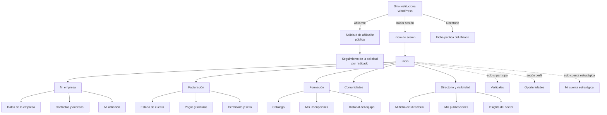

# Arquitectura de información del portal del afiliado

**Versión 0.1 · 15 de septiembre de 2026 · Estado: propuesto**

Cómo se organiza el portal para el afiliado: qué pantallas existen, cómo se navega entre ellas, qué ve cada rol y cómo se recorren los trámites. Es el puente entre el catálogo de requerimientos (`docs/02-catalogo-de-requerimientos.md`) y la construcción de la interfaz, y la base del *shell* de experiencia de la Fase 0.

> **Alcance de esta versión.** El estado actual se conoce desde fuera (ver `docs/audit/2026-09-ecosistema-web-actual.md`): el entorno de desarrollo no tiene acceso de red a `fedesoft.org`. Lo que aquí se propone se deriva de la arquitectura funcional y del catálogo de requerimientos. La sección 8 lista qué se confirma o ajusta cuando llegue la captura de las pantallas actuales.

---

## 1. El problema que resuelve la navegación

Hoy el afiliado tiene **tres puertas distintas para lo mismo** —"Zona de afiliados", "Espacio de afiliados" y "Escritorio de servicios para afiliados"— más dos subdominios separados (afiliaciones y pagos) y un directorio en otro dominio. Ninguna sabe quién es él ni qué le corresponde.

El portal invierte esa lógica: **una sola puerta que ya sabe quién entra.** La navegación no es un índice de todo lo que existe, sino lo que le aplica a esa empresa y a ese contacto.

Tres reglas de diseño:

1. **Una sola entrada.** Un inicio de sesión, un inicio, una navegación. Nada de secciones paralelas con nombres parecidos.
2. **La navegación se adapta, no se oculta.** Lo que un rol no puede usar no aparece en su menú; y el servidor lo rechaza aunque llegue por dirección directa. Esconder un botón nunca es el control.
3. **Cada pantalla resuelve algo.** Si una pantalla solo informa de que hay que escribir a alguien, no está terminada.

## 2. Del ecosistema actual al portal

| Dónde está hoy | A dónde va |
|---|---|
| "Zona de afiliados", "Espacio de afiliados", "Escritorio de servicios" | **Inicio** del portal, una sola pantalla personalizada |
| `afiliaciones.fedesoft.org` | **Afiliación** (público: solicitud · privado: estado y datos) |
| `pagos.fedesoft.org` | **Facturación → Estado de cuenta**, con pago integrado |
| `fedesoft.co` (directorio) | **Directorio**, alimentado por el perfil, y ficha pública |
| Formularios de actualización de datos | **Mi empresa**, edición directa |
| Formularios de inscripción a cursos y comunidades | **Formación** y **Comunidades**, inscripción de un clic |
| Convocatorias en formularios externos | **Oportunidades**, filtradas por perfil |
| Solicitud de certificado por correo | **Facturación → Certificado y sello**, descarga inmediata |

## 3. Mapa de navegación

**Navegación secundaria**, siempre disponible en el encabezado: buscador, notificaciones, menú de usuario (mi perfil personal, cambiar de empresa si aplica, ayuda, cerrar sesión).

## 4. Qué ve cada rol

La navegación se compone de tres factores: **rol del contacto**, **segmento de la empresa** y **estado de la afiliación**.

| Sección | Gerente | Talento humano | Contacto | Se activa si |
|---|---|---|---|---|
| Inicio | ✓ | ✓ | ✓ | Siempre |
| Mi empresa · datos | Editar | Ver | Ver | Siempre |
| Mi empresa · contactos y accesos | Editar | — | — | Siempre |
| Mi empresa · afiliación | ✓ | Ver | — | Siempre |
| Facturación | ✓ | — | — | Siempre para el gerente |
| Formación | ✓ | ✓ (gestiona al equipo) | ✓ (propias) | Siempre |
| Comunidades | ✓ | ✓ | Según elegibilidad | Comunidades elegibles por rol |
| Directorio y visibilidad | Editar | Ver | Ver | Siempre |
| Verticales | ✓ | ✓ | Ver | La empresa participa en al menos una |
| Oportunidades | ✓ | — | — | Hay oportunidades que aplican al perfil |
| Mi cuenta estratégica | ✓ | ✓ | — | Segmento = cuenta estratégica |

**El estado de la afiliación modula, no bloquea.** Una empresa no vigente sigue viendo su portal, con un aviso persistente y la acción de regularizar a un clic; lo que se inhabilita son los beneficios (certificado, sello, inscripciones, "verificado" en el directorio), siempre explicando por qué.

## 5. Inventario de pantallas

| ID | Pantalla | Ruta | Quién | Fase |
|---|---|---|---|---|
| P-01 | Inicio de sesión | `/entrar` | Público | 1 |
| P-02 | Recuperar acceso | `/entrar/recuperar` | Público | 1 |
| P-03 | Solicitud de afiliación | `/afiliarme` | Público | 1 |
| P-04 | Seguimiento de la solicitud | `/afiliarme/estado` | Público con radicado | 1 |
| P-05 | **Inicio** | `/` | Todos | 1 |
| P-06 | Datos de la empresa | `/empresa` | Gerente edita · resto ve | 1 |
| P-07 | Contactos y accesos | `/empresa/contactos` | Gerente | 1 |
| P-08 | Mi afiliación e historial | `/empresa/afiliacion` | Gerente · Talento ve | 1 |
| P-09 | Estado de cuenta | `/facturacion` | Gerente | 2 |
| P-10 | Pagar | `/facturacion/pagar` | Gerente | 2 |
| P-11 | Resultado del pago | `/facturacion/pagar/resultado` | Gerente | 2 |
| P-12 | Pagos y facturas | `/facturacion/documentos` | Gerente | 2 |
| P-13 | Certificado y sello | `/facturacion/certificado` | Gerente | 2 |
| P-14 | Verificación pública de certificado | `/verificar/{folio}` | Público | 2 |
| P-15 | Catálogo de formación | `/formacion` | Todos | 3 |
| P-16 | Detalle de curso o sesión | `/formacion/{id}` | Todos | 3 |
| P-17 | Mis inscripciones | `/formacion/mis-inscripciones` | Todos | 3 |
| P-18 | Historial del equipo | `/formacion/equipo` | Gerente · Talento | 3 |
| P-19 | Comunidades | `/comunidades` | Según elegibilidad | 3 |
| P-20 | Detalle de comunidad | `/comunidades/{id}` | Participantes | 3 |
| P-21 | Mi ficha del directorio | `/visibilidad/ficha` | Gerente edita | 3 |
| P-22 | Mis publicaciones y ofertas | `/visibilidad/publicaciones` | Gerente | 3 |
| P-23 | Insights del sector | `/visibilidad/insights` | Según tipo de afiliación | 3 |
| P-24 | Directorio público | `/directorio` | Público | 3 |
| P-25 | Verticales | `/verticales` | Participantes | 4 |
| P-26 | Detalle de vertical | `/verticales/{id}` | Participantes | 4 |
| P-27 | Oportunidades | `/oportunidades` | Filtrado por perfil | 4 |
| P-28 | Detalle y postulación | `/oportunidades/{id}` | Gerente | 4 |
| P-29 | Mis postulaciones | `/oportunidades/mis-postulaciones` | Gerente | 4 |
| P-30 | Mi cuenta estratégica | `/cuenta-estrategica` | Cuentas estratégicas | 4 |
| P-31 | Mi perfil personal | `/mi-perfil` | Todos | 1 |
| P-32 | Notificaciones | `/notificaciones` | Todos | 3 |
| P-33 | Ayuda y contacto | `/ayuda` | Todos | 1 |

Estados transversales de cada pantalla: cargando · vacío · error · sin permiso · éxito.

## 6. La pantalla de inicio

Es la que reemplaza las tres puertas actuales. Responde tres preguntas en el primer vistazo: **¿estoy bien?**, **¿tengo algo pendiente?**, **¿qué hay para mí?**

| Bloque | Contenido | Condición |
|---|---|---|
| **Estado de la afiliación** | Al día / pendiente / vencida, con la fecha de vigencia | Siempre |
| **Acción pendiente** | El cargo por vencer, la solicitud en curso o el dato incompleto, con su acción directa | Solo si existe algo pendiente |
| **Accesos rápidos** | Las cuatro acciones más usadas según el rol: pagar, descargar certificado, inscribirse, actualizar datos | Siempre, adaptados al rol |
| **Próximas sesiones** | Formación y mesas a las que el contacto está inscrito | Si tiene inscripciones |
| **Novedades para ti** | Oportunidades aplicables, nuevos cursos, publicaciones de la vertical | Filtrado por perfil |
| **Tu cuenta estratégica** | KAM asignado y resumen consolidado | Solo cuentas estratégicas |

Sin panel pendiente, el bloque de acción desaparece: **no se muestra una tarjeta vacía diciendo que no hay nada**.

## 7. Recorridos críticos

### F1 · Pagar y obtener el certificado (el recorrido que justifica el proyecto)

`P-05 Inicio` → aviso de cargo pendiente → `P-09 Estado de cuenta` → seleccionar cargos → `P-10 Pagar` → pasarela externa → `P-11 Resultado` → el sistema confirma servidor a servidor, emite la factura y actualiza la afiliación → `P-13 Certificado` habilitado.

Puntos de cuidado en la interfaz:
- La pantalla de resultado **no** decide el estado del pago: consulta al servidor y muestra "confirmando" mientras llega la confirmación real.
- Si el afiliado cierra el navegador a mitad del proceso, al volver ve el estado correcto.
- Si la factura aún se está emitiendo, el pago ya se muestra aplicado y la factura como "en proceso"; nunca se le dice al afiliado que algo falló cuando su pago sí entró.

### F2 · Actualizar los datos de la empresa

`P-05` → `P-06 Datos de la empresa` → editar → guardar → confirmación, y el cambio ya está en el directorio. Sin formulario, sin espera, sin doble digitación. Reemplaza el trámite por correo.

### F3 · Inscribir al equipo a una formación

`P-15 Catálogo` (filtrado por elegibilidad) → `P-16 Detalle` → elegir participantes entre los contactos de la empresa → confirmar → queda en `P-17` y en `P-18 Historial del equipo`. Si no hay cupo, entra en lista de espera con aviso claro.

### F4 · Postularse a una oportunidad

`P-05` → novedad → `P-27 Oportunidades` (solo las que aplican) → `P-28 Detalle` → postular con adjuntos → radicado → seguimiento en `P-29`, con notificación en cada cambio de estado.

## 8. Qué se confirma o ajusta con la captura del sitio actual

Cada punto corresponde a una pantalla de la guía `docs/audit/GUIA-DE-CAPTURA.md`:

| Qué falta | Qué cambiaría aquí |
|---|---|
| Campos reales del formulario de actualización de datos | El contenido exacto de `P-06` y `P-07`, y el modelo de `Organization` y `Contact` |
| Qué identifica al usuario al entrar (correo, NIT, documento) | `P-01` y la estrategia de migración de accesos |
| Menú actual tras iniciar sesión | Confirma o corrige las secciones de la sección 3 y sus nombres |
| Flujo de pago vigente y su comprobante | `P-09` a `P-12`, y qué espera hoy el afiliado como soporte |
| Cómo se solicita hoy el certificado | Cuánto cambia el hábito con `P-13` |
| Campos de la ficha del directorio | `P-21` y qué se migra desde `fedesoft.co` |
| Vista administrativa, si existe | Insumo directo para la consola (`docs/01-consola-administracion.md`) |

Mientras tanto, este documento es suficiente para construir el *shell* de experiencia de la Fase 0: la navegación, los estados y las pantallas base no cambian con el detalle pendiente.
